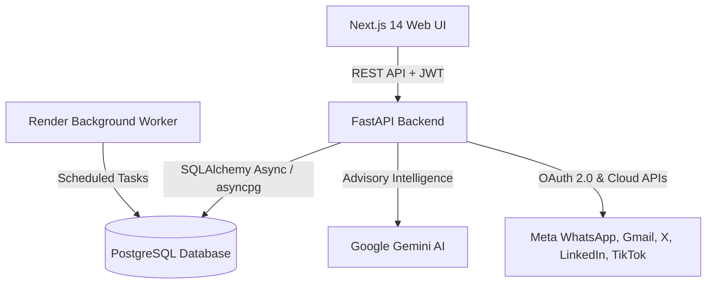
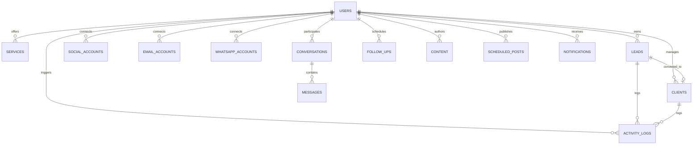

# Client Magnet - Secure Multi-User SaaS Platform

Client Magnet is an enterprise-grade, multi-user SaaS platform built for high-intent client discovery, AI-assisted communication, multi-platform social media publishing, visual CRM pipeline management, and real-time business analytics with pure PostgreSQL backend isolation, modern cryptography, and Render production deployment.

---

## 1. System & Architecture Overview



### Core Architecture Capabilities
- **Authentication & Security**: Argon2id password hashing, sliding-window login rate limiting, short-lived JWT access tokens (30m), revocable refresh tokens (7d), AES-256 Fernet credential encryption at rest.
- **CRM Lead Pipeline**: Interactive 9-stage visual Kanban pipeline (`NEW` → `QUALIFIED` → `CONTACTED` → `REPLIED` → `INTERESTED` → `DISCOVERY` → `PROPOSAL` → `NEGOTIATION` → `WON` / `LOST`), stage transition history, and non-destructive conversion of won leads into permanent Client records.
- **PostgreSQL Business Analytics**: Real-time aggregation of funnel conversions (`Lead → Qualified`, `Qualified → Contacted`, `Contacted → Replied`, `Replied → Won`), service ROI breakdown, and lead source acquisition performance.
- **Activity Timeline & Global Search**: Tenant-isolated global search across leads, clients, conversations, and messages with full chronological event auditing.
- **Unified Cross-Platform Inbox**: Centralized message management across Email, WhatsApp, and Social accounts with Gemini conversation summarization and reply suggestion.
- **Social Content Studio**: Multi-platform post authoring, AI caption generation with tone presets, calendar scheduling, and direct publishing.
- **Render Production Ready**: Complete `render.yaml` Blueprint, Dockerfiles, health check endpoints (`/health`), zero secrets committed, and automated database migrations.

---

## 2. Database Schema (PostgreSQL)

PostgreSQL is the **exclusive database** for the entire application. No secondary database (e.g. MongoDB, Redis, ClickHouse) is used.



---

## 3. Production Deployment on Render

The repository includes a ready-to-deploy `render.yaml` Blueprint specifying:
1. **Web Service (`client-magnet-backend`)**: Python FastAPI backend with automatic Alembic migrations on deployment.
2. **Web Service (`client-magnet-frontend`)**: Next.js 14 production build.
3. **Background Worker (`client-magnet-worker`)**: Task scheduler running background social publishing and due follow-up processing.
4. **Managed PostgreSQL (`client-magnet-db`)**: Managed database with automated backups and connection pooling.

### Deploying to Render in 3 Steps:
1. Fork or push the repository to GitHub.
2. Log in to [Render Dashboard](https://dashboard.render.com) and click **New > Blueprint**.
3. Connect your repository. Render will automatically provision the database, backend web service, worker, and frontend.

For disaster recovery, database snapshots, and migration rollback guides, see [`docs/DATABASE_BACKUP_AND_RECOVERY.md`](file:///c:/Users/deliv/Desktop/MY%20WEBSITE%20FOLDER/my%20bot/docs/DATABASE_BACKUP_AND_RECOVERY.md) and [`docs/PRODUCTION_CHECKLIST.md`](file:///c:/Users/deliv/Desktop/MY%20WEBSITE%20FOLDER/my%20bot/docs/PRODUCTION_CHECKLIST.md).

---

## 4. Local Development

### Prerequisites
- Python 3.11+
- Node.js 18+
- PostgreSQL 15+

### 1. Backend Setup
```bash
cd backend
python -m venv venv
# Windows:
venv\Scripts\activate
# Linux/macOS:
source venv/bin/activate

pip install -r requirements.txt
cp .env.example .env

# Run migrations
alembic upgrade head

# Start API server
uvicorn app.main:app --reload --port 8000
```

### 2. Frontend Setup
```bash
cd frontend
npm install
npm run dev
```
Open [http://localhost:3000](http://localhost:3000) in your browser.

---

## 5. Automated Test Suite

Run the full pytest suite (86+ test cases with 100% pass rate):
```bash
cd backend
python -m pytest -v
```

Run frontend production build verification:
```bash
cd frontend
npm run build
```

---

## 6. Security Standards

- **Zero Plaintext Credentials**: All OAuth tokens and API secrets are Fernet AES-256 encrypted at rest.
- **Tenant Isolation**: Every backend query filters by `user_id == current_user.id`.
- **Sliding-Window Rate Limiting**: Protects against brute-force attacks and abuse.
- **Safe Error Masking**: Unhandled exceptions return generic error responses without exposing server internals.
- **Zero Anti-Bot Bypass**: Uses only official OAuth 2.0 protocols and approved platform APIs (Google, Meta, X, LinkedIn, TikTok).
