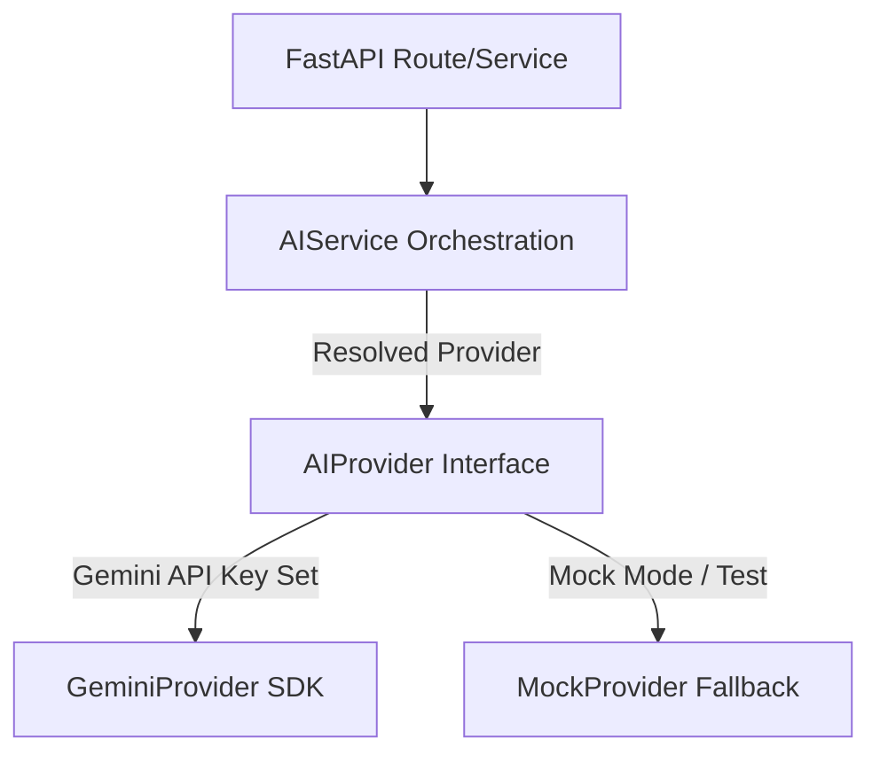

# Client Magnet: Architectural Concept & Design Document

This document outlines the foundation architectural principles for **Client Magnet**.

## 1. Monorepo Overview
Client Magnet is organized as a decoupled monorepo:
- **`backend/`**: FastAPI (Python 3.11+) containing the REST API layers, database sessions, task orchestration, compliance gates, and AI abstractions.
- **`frontend/`**: Next.js (TypeScript) single-page-app / dashboard shell with server-side proxy boundary.

---

## 2. AI Abstraction Layer (`AIService`)

The system does not interface with the Gemini API directly in business components. Instead, it routes all AI requests through the `AIService` abstraction. This facilitates testing, switching providers (e.g., to Anthropic, OpenAI, or local models), and managing system-wide prompts, token tracking, and caching.

### Provider Interface
The `AIProvider` base class (in `backend/app/services/ai.py`) dictates how any provider must implement text generation:
```python
class AIProvider(ABC):
    @abstractmethod
    async def generate_text(self, prompt: str, **kwargs) -> str:
        """Generate text from a prompt string asynchronously."""
        pass
```

### Flow Diagram


---

## 3. Compliance Framework (`ComplianceService`)

Compliance is a core tenet of the platform. The platform is designed strictly around official integrations and respectful usage boundaries. The system will **never** contain features to bypass platform protections (CAPTCHA evasion, account-ban dodging, unauthorized scrapers).

### Design Rules
1. **Official APIs Only**: Integrations must exclusively utilize official API structures.
2. **Pre-Flight Validation**: Before any message is sent or scraping is attempted, the `ComplianceService` checks:
   - Recipient opt-out register status.
   - Platform throttling limits (e.g., daily message counts).
   - Content compliance (verifying standard templates and avoiding prohibited keywords).

### Code Hook Structure
Every action (e.g., sending an outreach message) is validated as follows:
```python
compliance_result = await compliance_service.check_action(
    user_id=user.id,
    action_type="send_email",
    payload={"recipient": "lead@example.com", "body": "..."}
)
if not compliance_result["allowed"]:
    raise HTTPException(status_code=400, detail=compliance_result["reason"])
```

---

## 4. PostgreSQL Connection & Lifespan
- **SQLAlchemy 2.0 Async Session Management**: Uses async engine pools configured safely via environment variables.
- **Session Lifecycle**: Database sessions are bound to the FastAPI request lifespan using `Depends(get_db)`.
- **Single Source of Truth**: No intermediate caches (like Redis) are utilized in this foundation to keep PostgreSQL as the robust source of truth.
