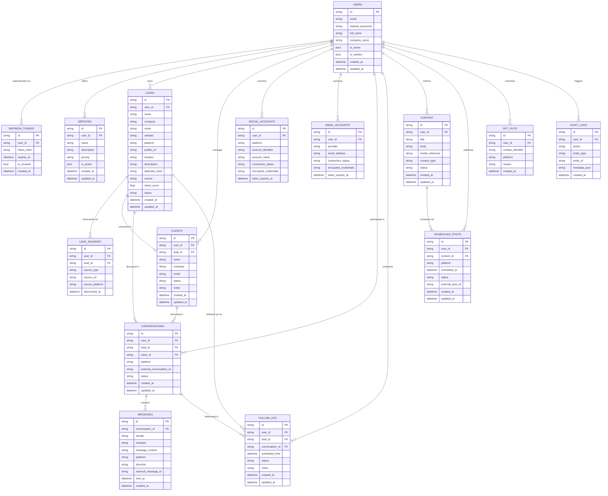

# Client Magnet: Database Architecture Document

This document describes the complete PostgreSQL database architecture for the Client Magnet multi-user SaaS platform.

---

## 1. Design Principles

| Principle | Implementation |
|---|---|
| **Single Database** | PostgreSQL only. No MongoDB, Firebase, SQLite (prod), or Redis as a DB. |
| **Multi-Tenant Isolation** | Every business data table has a `user_id` foreign key enforced at the database level. |
| **Cascade Safety** | Deleting a user cascades to all owned data. Cross-user references use `SET NULL`. |
| **Encrypted Credentials** | OAuth tokens in `social_accounts` and `email_accounts` are AES-256 encrypted at rest. |
| **No Raw Secrets** | No plaintext passwords, tokens, or API keys in any column. |
| **UUID Primary Keys** | All tables use string UUIDs (v4) for IDs to prevent enumeration attacks. |

---

## 2. Entity Relationship Diagram



---

## 3. Table Reference

### `users`
Root entity for all multi-tenant data.

| Column | Type | Constraints | Notes |
|---|---|---|---|
| `id` | VARCHAR(36) | PK, Indexed | UUID v4 |
| `email` | VARCHAR(255) | UNIQUE, NOT NULL, Indexed | Normalized to lowercase |
| `hashed_password` | VARCHAR(255) | NOT NULL | Argon2id hash |
| `full_name` | VARCHAR(255) | Nullable | |
| `company_name` | VARCHAR(255) | Nullable | |
| `is_active` | BOOLEAN | NOT NULL, default=true | Account status |
| `is_verified` | BOOLEAN | NOT NULL, default=false | Email verification |
| `created_at` | TIMESTAMPTZ | NOT NULL | |
| `updated_at` | TIMESTAMPTZ | NOT NULL | |

### `services`
Services each user offers. **Configurable per user** — not hardcoded.

| Column | Type | Constraints |
|---|---|---|
| `id` | VARCHAR(36) | PK |
| `user_id` | VARCHAR(36) | FK → users (CASCADE) |
| `name` | VARCHAR(255) | NOT NULL |
| `description` | TEXT | Nullable |
| `pricing` | VARCHAR(255) | Nullable |
| `is_active` | BOOLEAN | NOT NULL, default=true |
| `created_at` | TIMESTAMPTZ | NOT NULL |
| `updated_at` | TIMESTAMPTZ | NOT NULL |

### `leads`
Prospect pipeline with enriched profile data.

| Column | Type | Constraints | Notes |
|---|---|---|---|
| `id` | VARCHAR(36) | PK | |
| `user_id` | VARCHAR(36) | FK → users (CASCADE), Indexed | |
| `name` | VARCHAR(255) | NOT NULL | |
| `company` | VARCHAR(255) | Nullable | |
| `email` | VARCHAR(255) | Nullable, Indexed | |
| `website` | VARCHAR(500) | Nullable | |
| `platform` | VARCHAR(50) | Nullable, Indexed | e.g. "linkedin", "twitter" |
| `profile_url` | VARCHAR(500) | Nullable | |
| `location` | VARCHAR(255) | Nullable | |
| `description` | TEXT | Nullable | |
| `detected_need` | TEXT | Nullable | AI-inferred need |
| `source` | VARCHAR(100) | NOT NULL, default="Manual" | |
| `intent_score` | FLOAT | NOT NULL, default=0.0, Indexed | 0.0–1.0 |
| `status` | VARCHAR(50) | NOT NULL, default="Matching", Indexed | |
| `created_at` | TIMESTAMPTZ | NOT NULL, Indexed | |
| `updated_at` | TIMESTAMPTZ | NOT NULL | |

### `social_accounts` & `email_accounts`
Prepared for future OAuth integrations. **Credentials stored encrypted.**

> [!IMPORTANT]
> The `encrypted_credentials` column stores a Fernet-encrypted JSON blob (never plaintext tokens). The application layer decrypts on read via the `credentials` property.

### `opt_outs`
Global opt-out register for outreach compliance.

- Unique constraint: `(user_id, contact_identifier, platform)` — prevents duplicate entries.
- Future outreach systems **must** check this table before sending any message.

---

## 4. Index Strategy

Indexes are placed on high-cardinality columns used in WHERE clauses and ORDER BY:

| Table | Indexed Columns |
|---|---|
| `users` | `email` (UNIQUE), `id` |
| `leads` | `user_id`, `email`, `platform`, `status`, `intent_score`, `created_at` |
| `services` | `user_id`, `is_active` |
| `clients` | `user_id`, `lead_id`, `email`, `status` |
| `conversations` | `user_id`, `lead_id`, `client_id`, `platform`, `external_conversation_id`, `status` |
| `messages` | `conversation_id`, `external_message_id`, `sent_at` |
| `follow_ups` | `user_id`, `lead_id`, `scheduled_time`, `status` |
| `scheduled_posts` | `user_id`, `platform`, `scheduled_at`, `status` |
| `opt_outs` | `user_id`, `contact_identifier`, `platform`, `created_at` |
| `audit_logs` | `user_id`, `action`, `entity_type` |

---

## 5. Migration History

| Version | Description |
|---|---|
| `001_initial_auth` | `users`, `refresh_tokens`, `leads` (basic) tables |
| `002_core_saas_schema` | Full SaaS schema: `services`, `lead_sources`, `clients`, `social_accounts`, `email_accounts`, `conversations`, `messages`, `follow_ups`, `content`, `scheduled_posts`, `opt_outs`, `audit_logs`. |
| `003_services_leads_foundation` | Enriched `services` (`target_clients`, `portfolio_links`), enriched `leads` (`phone`, `source_url`, `notes`, `matched_service_id` FK → `services.id`), strict `status` enum support. |

---

## 6. Security Architecture

```
Next.js Frontend
      │ (HTTPS only, no DB credentials)
      ↓
FastAPI Backend
      │ Argon2id hashing, JWT auth, Fernet encryption
      ↓
PostgreSQL Database
      │ Row-level isolation via user_id FK on all business tables
      │ Cascade deletes on user removal
      │ Encrypted credentials columns for OAuth tokens
```

**Rules enforced at every layer:**
- Frontend → never has DB credentials or raw tokens
- API → always resolves `user_id` from JWT, never from request body
- Database → FK constraints prevent orphaned or cross-user records
- Audit → sensitive values (passwords, tokens) never appear in `audit_logs.metadata_json`
